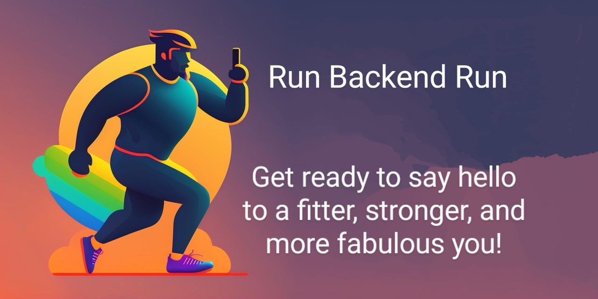

# RunBackEndRun

A backend project to use for a clone of Runtastic app

## Functionnalities

An api that requires user authentification.

A jwt is necessary to access activities that are created and stored in database.

Activities (for instance it can be running or cycling) store the start date, the duration, the speed, the distance and the different locations (Latitudes, Longitudes) of the recorded activity.

When the jwt is expired, a refresh token can be used to create a new one.

## Getting Started

### Prerequisites

You need docker

### How to run

```
docker compose pull
docker compose build app
docker compose up
```